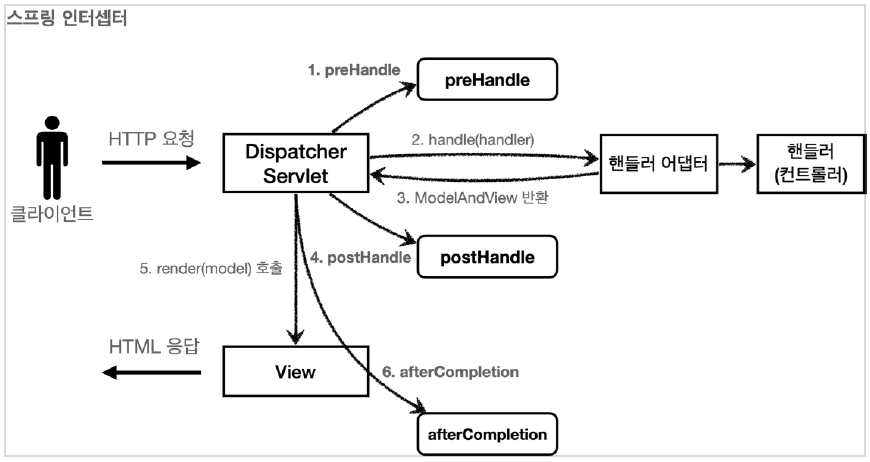
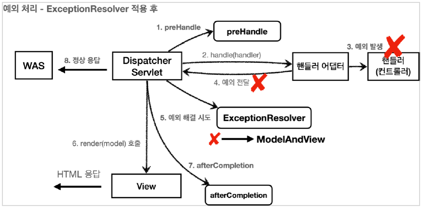
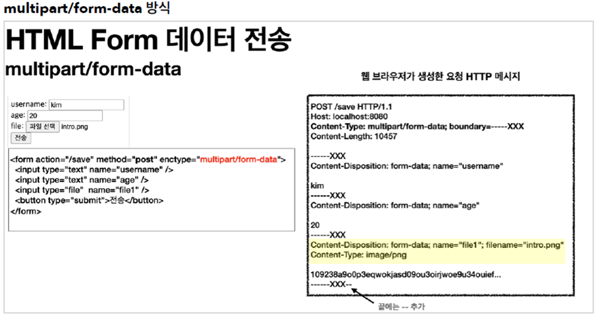

# spring-mvc-2
[인프런] 스프링 MVC 2편 - 백엔드 웹 개발 활용 기술  
[목차 바로가기](./INDEX.md)

## 3. 메시지, 국제화

### 3.1 메시지, 국제화 소개

- 다양한 메시지를 한 곳에서 관리하도록 하는 기능을 메시지 기능. HTML에 하드코딩 X
- 메시지를 나라별로 별도로 관리하면 국제화
- 접근한 나라를 인식하는 방법은 HTTP `accept-language` 해더 값을 사용하거나 사용자가 직접 언어를 선택하도록 하고, 쿠키 등을 사용해서 처리

### 3.2 스프링 메시지 소스 설정

- 기본 설정 대로 사용한다면 messages.properties 파일 만들면 됨. 영어는 messages_en.properties
  application.yml에 `spring.messages.basename=messages` 설정 자동 적용되기 때문
- spring.messages.basename=messages,config.i18n.messages
  ⇒ messages.properties와
  ⇒ config.i18n 패키지 하위 message.properties를 읽겠다는 의미

### 3.3 스프링 메시지 소스 사용

- MessageSource 빈을 주입 받고 getMessage 메서드 사용

```java
String result = ms.getMessage("hello", null, null); // Locale이 null이면 기본 설정
String hello = ms.getMessage("hello", null, Locale.KOREA);
```

### 3.4 웹 애플리케이션에 메시지 적용하기

- 타임리프 예시
  `<div th:text="#{label.item}"></h2>`
- 파라미터 예시
  `<p th:text="#{[hello.name](http://hello.name/)(${item.itemName})}"></p>`

---

## 4. 검증1 - Validation

- **글로벌 오류 처리(ObjectError) vs 필드 오류 처리(FieldError)**
- **스프링이 직접하는 오류 vs 사용자가 검증하는 오류**
- bindingResult.reject() vs Validator vs Bean Validation
- SpringEL 필드 오류 처리
  `errors?.` 은 errors 가 null 일때 NullPointerException 이 발생하는 대신, null 을 반환하는 문법이다.

    ```html
    <div th:if="${errors?.containsKey('globalError')}">
    <p class="field-error" th:text="${errors['globalError']}">전체 오류 메시지</p>
    </div>
    ```

- `th:classappend`, `th:errorclass="field-error"`
  `<div class="field-error" th:errors="*{itemName}">`

### 4.6 BindingResult

- BindingResult는 자동으로 view에 넘어감으로 model에 안담아도 된다
- **파라미터 순서가 중요! ModelAttribute 다음에 BindingResult가 와야 됨**
- BindingResult 가 있으면 @ModelAttribute 에 데이터 바인딩 시 오류가 발생해도 컨트롤러가
  호출됨
- BindingResult 는 인터페이스이고, Errors 인터페이스를 상속받고 있다. 주로 관례상 BindingResult 를 많이 사용

### 4.8 FieldError, ObjectError

    📌 타입 오류로 바인딩에 실패하면 스프링은 FieldError 를 생성하면서 사용자가 입력한 값을 넣어둔다.
    그리고 해당 오류를 BindingResult 에 담아서 컨트롤러를 호출한다.
    따라서 타입 오류 같은 바인딩 실패시에도 사용자의 오류 메시지를 정상 출력할 수 있다.
    예) `new FieldError("item", "price", item.getPrice(), false, null, null, "가격은 1,000 ~ 1,000,000 까지 허용합니다.")`


- 생성자 파라미터 목록
    - `objectName` : 오류가 발생한 객체 이름
    - `field` : 오류 필드
    - `**rejectedValue**` : 사용자가 입력한 값(거절된 값)
    - `bindingFailure` : 타입 오류 같은 바인딩 실패(true)인지, 검증 실패(false)인지 구분 값
    - `codes` : 메시지 코드
    - `arguments` : 메시지에서 사용하는 인자
    - `defaultMessage` : 기본 오류 메시지
- **FieldError 생성자, rejectValue 파라미터를 이해하고 적절히 활용하는 것이 핵심**
- **오류 코드 레벨이 높은 것을 판단하는 것도 핵심**

### 4.9 오류 코드와 메시지 처리

- 오류 메시지를 일관성있게 관리할 수 있을까?
  ⇒ 내부적으로 messageSource 쓰면 됨
  ⇒ errors.propertes 파일 추가 & application.yml에 `spring.messages.basename=messages,errors`
- (예시)

    ```java
    bindingResult.addError(new FieldError("item", "price", item.getPrice(), false,
                        new String[]{"range.item.price"}, new Object[]{1000, 1000000}, null));
    bindingResult.rejectValue("price", "range", new Object[]{9999}, null);
    ```

- 여러 메시지(범용, 세밀)에 우선순위를 두어 구체적인 것, 범용 순으로 사용할 수 있을까?
  ⇒ 스프링이 `MessageCodesResolver` 제공. rejectValue() , reject() 는 내부에서 MessageCodesResolver 를 사용한다. 여기에서 메시지 코드들을 생성한다.
  ⇒ `MessageCodesResolver` 인터페이스이고 `DefaultMessageCodesResolver` 는 기본 구현체이다
  ⇒ `bindingResult.rejectValue()` 호출 시 넘긴 errorCode를 기준으로 규칙에 따라 MessageCodeResolver가 여러 오류 코드를 자동으로 생성하고 우선순위가 높은 메시지를 찾는다.
- DefaultMessageCodesResolver의 기본 메시지 생성 규칙


    📌 객체 오류의 경우 다음 순서로 2가지 생성
    1. code + "." + object name
    2. code
    예) 오류 코드: required, object name: item 이면
    1. required.item
    2. required

    필드 오류의 경우 다음 순서로 4가지 메시지 코드 생성
    1. code + "." + object name + "." + field
    2. code + "." + field
    3. code + "." + field type
    4. code
    예) 오류 코드: typeMismatch, object name "user", field "age", field type: int
    1. “typeMismatch.user.age”
    2. “typeMismatch.age”
    3. “typeMismatch.int”
    4. “typeMismatch”

- ValidationUtils 사용 코드 간소화
- 스프링이 직접 검증 오류에 추가한 경우는 어떻게 할까?
  ⇒ 스프링이 기본으로 오류코드 제공
  ⇒ 예) typeMismatch.item.price, typeMismatch.price, typeMismatch.java.lang.Integer, typeMismatch

### 4.15 Validator 분리

- Validator를 상속받아 별도의 컴포넌트 빈으로 분리
- WebDataBinder에 검증기를 추가하여 컨트롤러에서 검증기를 자동으로 적용할 수 있다.
  검증대상 앞에 `@Validated` 추가
- 검증기를 모든 컨트롤러에 공통으로 적용도 가능하다


    📌 @Valid 와 @Validated의 비교
    - @Validated는 스프링 전용 검증 애노테이션이고 @Valid는 자바 표준 검증 애노테이션
    - @Valid는 build.gradle에 의존관계 추가 필요
    - @Validated는 내부에 groups 기능 포함


---

## 5. 검증2 - Bean Validation

### 5.1 Bean Validation - 소개

- Bean Validation을 잘 활용하면, 애노테이션 하나로 검증 로직을 매우 편리하게 적용할 수 있다.
- Bean Validation은 구현체가 아니라 기술 표준이고 Hibernate Validator가 일반적
- **제공하는 검증 애노테이션은 매뉴얼에서 확인하자. Hibernate가 추가로 제공하는 애노테이션도 있다.**
  [https://docs.jboss.org/hibernate/validator/6.2/reference/en-US/html_single/#validator-defineconstraints-spec](https://docs.jboss.org/hibernate/validator/6.2/reference/en-US/html_single/#validator-defineconstraints-spec)

### 5.4 Bean Validation - 스프링 적용

- build.gradle에 의존관계 추가
  `implementation 'org.springframework.boot:spring-boot-starter-validation'`
- 스프링 부트는 자동으로 LocalValidatorFactoryBean 을 글로벌 Validator로 등록한다.
  @NotNull과 같은 애노테이션을 보고 검증을 수행
- 바인딩에 성공한 필드만 Bean Validation 적용된다. 실패하면 typeMismatch FieldError추가
  @ModelAttribute 각각의 필드 타입 변환시도 변환에 성공한 필드만 BeanValidation 적용

### 5.5 Bean Validation - 에러 코드

- Bean Validation은 에러코드가 애노테이션 이름으로 등록된다.
  예) @NotBlank → `NotBlank.item.itemName`, `NotBlank.itemName`, `NotBlank.java.lang.String`, `NotBlank`

### 5.6 Bean Validation - 오브젝트 오류

- (예시)

    ```java
    @ScriptAssert(lang = "javascript", script = "_this.price * _this.quantity >=
    10000", message = ”총합이 10000원 넘게 입력해 주세요”)
    ```

- 제약이 많아 권장하지 않음.

### 5.9 Bean Validation - groups

- 등록과 수정 시 각각 다른 Bean Validation 규칙을 적용할 수 있을까? ⇒ groups
- (예시)
  `@Validated(UpdateCheck.class) @ModelAttribute Item item`

    ```java
    @NotNull(groups = {SaveCheck.class, UpdateCheck.class})
    @Max(value = 9999, groups = SaveCheck.class)
    private Integer quantity;
    ```

- 복잡도가 올라가서 잘 안씀. 실무에서는 등록용, 수정용 객체를 분리

### 5.11 Form전송 객체 분리

- 실무에서 일반적으로 쓰는 방식
- 폼 객체를 도메인 객체로 변환하는 로직은 필요

### 5.13 Bean Validation - HTTP 메시지 컨버터

- Bean Validation은 `HttpMessageConverter` ( `@RequestBody` )에도 적용할 수 있다.
  즉, @ModelAttribute, @RequestBody 모두 가능
- (예시)

    ```java
    @PostMapping("/add")
    public Object addItem(@RequestBody @Validated ItemSaveForm form, BindingResult bindingResult) {}
    ```

- @ModelAttribute 는 필드 단위로 정교하게 바인딩이 적용된다. 특정 필드가 바인딩 되지 않아도 나머지 필드는 정상 바인딩 되고, Validator를 사용한 검증도 적용할 수 있다.
- @RequestBody 는 HttpMessageConverter 단계에서 JSON 데이터를 객체로 변경하지 못하면 이후 단계 자체가 진행되지 않고 예외가 발생한다. 컨트롤러도 호출되지 않고, Validator도 적용할 수 없다.

---

## 6. 로그인 처리1 - 쿠키, 세션

### 6.6 로그인 처리하기 - 쿠키 사용

- (예시) HttpServletResponse에 쿠키 담아 보내기

    ```java
    // 쿠키에 시간 정보를 주지 않으면 세션 쿠키 (브라우저 종료 시 모두 종료)
    Cookie idCookie = new Cookie("memberId", String.valueOf(loginMember.getId()));
    response.addCookie(idCookie);
    ```

- (예시) 쿠키 삭제하기

    ```java
    Cookie cookie = new Cookie(cookieName, null);
    cookie.setMaxAge(0);
    response.addCookie(cookie);
    ```

- 브라우저 확인
  네트워크 탭 Response Headers에서 `Set-Cookie`
  Application 탭 > Cookies

### 6.7 쿠키와 보안 문제

- 쿠키 값은 임의로 변경할 수 있고 쿠키에 보관된 정보는 훔쳐갈 수 있다.
  ⇒ (대안) 쿠키에 중요한 값을 노출하지 않고, 사용자 별로 임의의 토큰(랜덤 값)을 노출하고, 서버에서 토큰과 사용자id를 매핑해서 인식한다. 그리고 서버에서 토큰을 관리. 토큰의 만료 시간을 짧게 유지

### 6.11 로그인 처리하기 - 서블릿 HTTP 세션1

- **서블릿을 통해** HttpSession 을 생성하면 다음과 같은 쿠키를 생성한다. 쿠키 이름이 JSESSIONID 이고, 값은 추정 불가능한 랜덤 값이다.
  `Cookie: JSESSIONID=5B78E23B513F50164D6FDD8C97B0AD05`
- **getSession 매개변수 boolean에 따라 세션이 없으면 새로 생성할 지 결정**
- request.getSession(true)
    - 세션이 있으면 기존 세션을 반환한다. request.getSession()과 동일
    - 세션이 없으면 새로운 세션을 생성해서 반환한다.
- request.getSession(false)
    - 세션이 있으면 기존 세션을 반환한다.
    - 세션이 없으면 새로운 세션을 생성하지 않는다. null 을 반환한다.
- (예시)

    ```java
    // 세션이 있으면 있는 세션 반환, 없으면 신규 세션 반환
    HttpSession session = request.getSession();
    // 세션에 로그인 회원 정보 보관
    session.setAttribute(SessionConst.LOGIN_MEMBER, loginMember);
    ```


### 6.12 로그인 처리하기 - 서블릿 HTTP 세션2
- Spring이 제공하는 Session 관련 기능
- (예시) 이미 로그인된 사용자를 찾을 때. 이 기능은 세션을 생성하지는 않음
  `@SessionAttribute(name = SessionConst.*LOGIN_MEMBER*, required = false) Member loginMember`


    📌 TrackingModes
    로그인을 처음 시도하면 URL이 다음과 같이 jsessionid 를 포함하고 있는 것을 확인할 수 있다.
    예) http://localhost:8080/;jsessionid=F59911518B921DF62D09F0DF8F83F872
    이것은 웹 브라우저가 쿠키를 지원하지 않을 때 쿠키 대신 URL을 통해서 세션을 유지하는 방법임 (서버 입장에서는 웹브라우저가 쿠키를 지원하는지 최초에는 판단하지 못하기 때문)
    URP 전달방식을 끄려 다음 옵션을 추가
    server.servlet.session.tracking-modes=cookie


### 6.13 세션 정보와 타임아웃 설정

- 세션의 종료 시점
  ⇒ 사용자가 서버에 최근에 요청한 시간을 기준으로 30분 정도 유지 (HttpSession은 이 방식 사용)
- 세션의 타임아웃 설정 - 글로벌
  `server.servlet.session.timeout=60` : 60초, 기본은 1800(30분)
- 특정 세션의 개별 타임아웃 설정
  `session.setMaxInactiveInterval(1800);` //1800초
- 실무에서 주의할 점은 세션에는 최소한의 데이터만 보관해야 한다는 점이다. 보관한 데이터 용량 * 사용자 수로 세션의 메모리 사용량이 급격하게 늘어나서 장애로 이어질 수 있다

---

## 7. 로그인 처리 - 필터, 인터셉터

- **필터는 서블릿이 제공하는 기능이고 인터셉터는 스프링이 제공하는 기능임**
- **웹과 관련된 공통 관심사는 서블릿 필터 또는 스프링 인터셉터를 사용하는 것이 좋다. 서블릿 필터나 스프링 인터셉터는 HttpServletRequest 를 제공하기 때문.**

### 7.1 서블릿 필터 - 소개

- 필터는 서블릿이 지원하는 수문장
- **필터 흐름**  
  참고로 스프링을 사용하는 경우 여기서 서블릿은 디스패처 서블릿  
  `HTTP 요청 -> WAS -> 필터 -> 서블릿 -> 컨트롤러`
- **필터 제한**

  `HTTP 요청 -> WAS -> 필터 -> 서블릿 -> 컨트롤러 //로그인 사용자
  HTTP 요청 -> WAS -> 필터(적절하지 않은 요청이라 판단, 서블릿 호출X) //비 로그인 사용자`

- **필터 체인**  
  `HTTP 요청 -> WAS -> 필터1 -> 필터2 -> 필터3 -> 서블릿 -> 컨트롤러`
- **필터 인터페이스**  
  필터 인터페이스를 구현하고 등록하면 서블릿 컨테이너가 필터를 싱글톤 객체로 생성하고, 관리

    ```java
    public interface Filter {
    	public default void init(FilterConfig filterConfig) throws ServletException
    	{}
    	public void doFilter(ServletRequest request, ServletResponse response,
    	FilterChain chain) throws IOException, ServletException;
    	public default void destroy() {}
    }
    ```

    - `init()` : 필터 초기화 메서드, 서블릿 컨테이너가 생성될 때 호출
    - `doFilter()` : 고객의 요청이 올 때 마다 해당 메서드가 호출된다. 필터의 로직을 구현하면 됨
    - `destroy()` : 필터 종료 메서드, 서블릿 컨테이너가 종료될 때 호출

### 7.3 서블릿 필터 - 인증 체크

- (필터 등록 예시)
  서블릿에 필터를 등록하기 위해 FilterRegistrationBean 사용

    ```java
    @Bean
    public FilterRegistrationBean loginCheckFilter() {
        FilterRegistrationBean<Filter> filterRegistrationBean = new FilterRegistrationBean<>();
        filterRegistrationBean.setFilter(new LoginCheckFilter());
        filterRegistrationBean.setOrder(1);
        filterRegistrationBean.addUrlPatterns("/*");
        return filterRegistrationBean;
    }
    ```


### 7.4 스프링 인터셉터 - 소개

- **스프링 인터셉터는 디스패처 서블릿과 컨트롤러 사이에서 컨트롤러 호출 직전에 호출 된다.**
- **스프링 인터셉터 흐름**  
  `HTTP 요청 -> WAS -> 필터 -> 서블릿 -> 스프링 인터셉터 -> 컨트롤러`
- **스프링 인터셉터 제한**  

  `HTTP 요청 -> WAS -> 필터 -> 서블릿 -> 스프링 인터셉터 -> 컨트롤러 //로그인 사용자
  HTTP 요청 -> WAS -> 필터 -> 서블릿 -> 스프링 인터셉터(적절하지 않은 요청이라 판단, 컨트롤러 호출 X) // 비 로그인 사용자`

- **스프링 인터셉터 체인**  
  `HTTP 요청 -> WAS -> 필터 -> 서블릿 -> 인터셉터1 -> 인터셉터2 -> 컨트롤러`
- **스프링 인터셉터 인터페이스**

    ```java
    public interface HandlerInterceptor {
    	default boolean preHandle(HttpServletRequest request, HttpServletResponse
    	response,	Object handler) throws Exception {}
    	
    	default void postHandle(HttpServletRequest request, HttpServletResponse
    	response,	Object handler, @Nullable ModelAndView modelAndView) throws Exception {}
    
    	default void afterCompletion(HttpServletRequest request, HttpServletResponse
    	response,	Object handler, @Nullable Exception ex) throws Exception {}
    }
    ```

- 스프링 인터셉터는 서블릿 필터보다 편리하고, 더 정교하고 다양한 기능을 지원한다.  
  세밀한 URL 패턴, preHandle&postHandle 분리, 세밀한 매개변수 지원
  필터보단 인터셉터 사용 권장
- preHandle 메소드 리턴타입이 boolean임 주의. false이면 더이상 진행 안함
- **호출 흐름**
  Controller에서 예외 발생 시 postHandle은 호출되지 않음. afterCompletion은 호출 됨

  


### 7.5 스프링 인터셉터 - 요청 로그

- (인터셉터 등록 예시)

    ```java
    @Configuration
    public class WebConfig implements WebMvcConfigurer {
    	@Override
    	public void addInterceptors(InterceptorRegistry registry) {
    	    registry.addInterceptor(new LogInterceptor())
    	            .order(1)
    	            .addPathPatterns("/**")
    	            .excludePathPatterns("/css/**", "/*.ico", "/error");
    	}
    }
    ```


### 7.7 ArgumentResolver 활용

- 컨트롤러 호출 직전에 공통되는 파라미터 정보를 생성해 주는 등의 작업에 적합
- 검증 애노테이션 직접 만들기 예제 있음

---

## 8. 예외 처리와 오류 페이지

- 서블릿이 예외를 어떻게 처리하는 지 우선 이해를 하면 스프링의 방식을 이해할 수 있다.

### 8.1 서블릿 예외 처리 - 시작

- 서블릿은 다음 2가지 방식으로 예외 처리를 지원한다.
    - `Exception (예외)`
    - `response.sendError(HTTP 상태 코드, 오류 메시지)`
- **Exception**
  try ~ catch로 예외를 잡지 못하고 서블릿 밖으로 까지 예외가 전달되면?
  WAS(여기까지 전파) <- 필터 <- 서블릿 <- 인터셉터 <- 컨트롤러(예외발생)
- **sendError**

  WAS(sendError 호출 기록 확인) <- 필터 <- 서블릿 <- 인터셉터 <- 컨트롤러 (response.sendError())

  서블릿 컨테이너는 고객에게 응답 전에 response 에 sendError() 가 호출되었는지 확인한다.
  그리고 호출되었다면 설정한 오류 코드에 맞추어 기본 오류 페이지를 보여준다.


### 8.2 서블릿 예외 처리 - 오류 화면 제공

- 스프링 부트가 제공하는 기능을 사용해서 서블릿 오류 페이지를 등록할 수 있음
- 예외 발생과 오류 페이지 요청 흐름
    1. WAS(여기까지 전파) <- 필터 <- 서블릿 <- 인터셉터 <- 컨트롤러(예외발생)
    2. WAS `/error-page/500` 다시 요청 -> 필터 -> 서블릿 -> 인터셉터 -> 컨트롤러(/error-page/500) -> View
- 즉, 오류가 발생하면 오류 페이지 경로로 필터, 서블릿, 인터셉터, 컨트롤러가 모두 다시 호출된다.

### 8.3 서블릿 예외 처리 - 필터

- 예외가 발생할 때마다 모든 필터들이 전부 다시 호출될까? 그렇다면 비효율적이지 않을까?
  ⇒ 필터는 이런 경우를 위해서 DispatcherType 옵션 제공 (실제 고객이 요청한 건지 서버가 내부에서 오류 페이지 요청 한 건지 구분)
  ⇒ 그리고 필터는 REQUEST가 기본이기 때문에 안탐. 문제 없음
  `filterRegistrationBean.setDispatcherTypes(DispatcherType.*REQUEST*, DispatcherType.*ERROR*);`
- **DispatcherType**
    - REQUEST : 클라이언트 요청
    - ERROR : 오류 요청
    - FORWARD : MVC에서 배웠던 서블릿에서 다른 서블릿이나 JSP를 호출할 때RequestDispatcher.forward(request, response);
    - INCLUDE : 서블릿에서 다른 서블릿이나 JSP의 결과를 포함할 때
      RequestDispatcher.include(request, response);
    - ASYNC : 서블릿 비동기 호출

### 8.4 서블릿 예외 처리 - 인터셉터

- 인터셉터는 빈 등록 시 `excludePathPatterns()` 를 통해서 예외 발생해도 호출되지 않게 설정함

### 8.5 스프링 부트 - 오류 페이지1

- 스프링 부트가 제공하는 자동화된 방법으로 오류 페이지를 등록할 수 있을까?
  ⇒ 스프링 부트의 규약에 따라 정적 페이지를 만들면 된다.

    
    📌 1. 뷰 템플릿
    resources/templates/error/500.html
    resources/templates/error/5xx.html

    2. 정적 리소스( static , public )
    resources/static/error/400.html
    resources/static/error/404.html
    resources/static/error/4xx.html

    3. 적용 대상이 없을 때 뷰 이름( error )
    resources/templates/error.html
    

- 스프링 부트는 /error 라는 경로로 기본 오류페이지를 설정한다. 그리고 /error 를 매핑해서 처리하는 컨트롤러인 BasicErrorController 를 자동으로 등록

---

## 9. API 예외 처리

- 서블릿이 제공하는 방식으로 ErrorPage를 등록하고 `produces = MediaType.*APPLICATION_JSON_VALUE*` 속성을 사용하여 html이 아닌 json을 리턴하는 방식 있다.

### 9.2 스프링 부트 기본 오류처리

- 스프링 부트가 제공하는 방식으로는 기본 등록된 BasicErrorController를 활용하는 방식이 있다.
- BasicErrorController에는 error() 와 errorHtml() 두 메서드가 있어 리턴타입 (html/json)에 따라 각각 수행된다.

### 9.3 HandlerExceptionResolver 시작

- WAS까지 예외가 전달되면 상태코드가 500으로 처리
  ⇒ 컨트롤러 밖으로 던져진 예외도 500이 아닌 다른 코드도 처리할 수 없을까?
  ⇒ HandlerExceptionResolver 생성. 인터페이스 확인하여 구현할 것
- **ExceptionResolver 적용 후**
  ※ 적용 해도 postHandle은 호출되지 않음

  


### 9.5 HandlerExceptionResolver 활용

- 예외가 발생하면 WAS까지 가서 다시 내부 호출 없이 끝낼 수 있을까?
  ⇒ HandlerExceptionResolver에서 빈 ModelAndView를 리턴하면 뷰를 렌더링하지 않고 정상 흐름 반환
  ⇒ 서블릿 컨테이너까지 가서 /error 로 BasicErrorController 호출하지 않음
- ExceptionResolver는 결국 Controller에서 예외 발생했을 때, DispatcherServlet이 해결할 수 있는 지 물어보는 대상임. ModelAndView 반환하면 다시 /error 호출할 필요 없이 서블릿 컨테이너에게 결과 반환. WAS에서는 정상 처리.
- ExceptionResolver는 여러 개 등록 가능하나 하나에서 해결하면 다음 Resolver는 호출되지 않음

### 9.5 스프링이 제공하는 ExceptionResolver1

- 스프링 부트가 기본으로 제공하는 ExceptionResolver는 다음과 같다
    1. `ExceptionHandlerExceptionResolver`
    2. `ResponseStatusExceptionResolver` ⇒ HTTP 응답 코드 변경
    3. `DefaultHandlerExceptionResolver` ⇒ 우선 순위가 가장 낮다. 스프링 내부 예외 처리
- **ResponseStatusExceptionResolver**
- HTTP 상태 코드를 변경해 주는 역할
- 내부적으로 response.sendError(statusCode, resolvedReson)을 호출하는 방식이기 때문에 WAS에서 다시 오류페이지(/error)로 내부 요청
- reson을 messageSource에서 찾는 기능도 제공

    ```java
    @ResponseStatus(code = HttpStatus.BAD_REQUEST, reason = "잘못된 요청 오류")
    public class BadRequestException extends RuntimeException {
    
    }
    ```


### 9.6 스프링이 제공하는 ExceptionResolver2

- 파라미터가 맞지 않는 TypeMismatchException 같은 경우 서블릿 컨테이너에 전달 돼 500으로 처리되지 않을까?
  ⇒ 스프링이 자동으로 400으로 반환하게 처리한다. `DefaultHandlerExceptionResolver`가 스프링 내부에서 발생하는 여러가지 예외를 해결

### 9.7 @ExceptionHandler

- HandlerExceptionResolver를 직접 사용하는 것은 복잡. ModelAndView를 반환해야되는 것이 API 흐름에는 맞지 않음 ⇒ Spring이 더 간편한 방식 제공.
- **실무에서 API 예외처리는 대부분 이 기능 사용**
- **호출 흐름**  
  예외가 발생하면 가장 우선순위가 높은 `ExceptionHandlerExceptionResolver` 가 실행되고 해당 예외를 처리할 수 있는 `@ExceptionHandler` 가 있는 지 확인한다.  
  메소드에 @ResponseBody 가 적용되면 HTTP 컨버터가 사용되고 응답이 JSON으로 반환된다.
- **HTTP 상태코드 지정하려면**  
  `@ResponseStatus(HttpStatus.BAD_REQUEST)`
- **예외 생략**  
  @ExceptionHandler 에 예외를 생략할 수 있다. 생략하면 메서드 파라미터의 예외가 지정된다
- **우선 순위**  
  스프링의 우선순위는 항상 자세한 것이 우선권을 가진다. 부모보다 자식이 우선
- **다양한 예외**  
  @ExceptionHandler({AException.class, BException.class})
- ExceptionHandler는 다양한 파라미터와 응답을 지원한다.  
  공식문서 : [https://docs.spring.io/spring-framework/reference/web/webmvc/mvc-controller/ann-exceptionhandler.html#mvc-ann-exceptionhandler-return-values](https://docs.spring.io/spring-framework/reference/web/webmvc/mvc-controller/ann-exceptionhandler.html#mvc-ann-exceptionhandler-return-values)

### 9.8 @ControllerAdvice

- `@ControllerAdvice` 또는 `@RestControllerAdvice` 를 사용하면 정상코드와 예외처리 코드를 분리할 수 있다.
- @Controller에 대상을 지정하지 않으면 모든 컨트롤러에 다 적용 (글로벌 적용)
- 대상 컨트롤러 지정 방법

    ```java
    // Target all Controllers annotated with @RestController
    @ControllerAdvice(annotations = RestController.class)
    public class ExampleAdvice1 {}
    // Target all Controllers within specific packages
    @ControllerAdvice("org.example.controllers")
    public class ExampleAdvice2 {}
    // Target all Controllers assignable to specific classes
    @ControllerAdvice(assignableTypes = {ControllerInterface.class, AbstractController.class})
    public class ExampleAdvice3 {}
    ```

- **결국, API 예외 처리는 @ExceptionHandler 와 @ControllerAdvice 를 조합해서 사용하자.**

---

## 10. 스프링 타입 컨버터

### 10.2 스프링 타입 컨버터 소개

- 스프링 MVC 요청 파라미터
    - @RequestParam , @ModelAttribute , @PathVariable
- @Value 등으로 YML 정보 읽기
- XML에 넣은 스프링 빈 정보를 변환
- 뷰를 렌더링 할 때

### 10.3 타입 컨버터

- 컨버터를 만들려면 `org.springframework.core.convert.converter.Converter` 를 구현

    ```jsx
    package org.springframework.core.convert.converter;
    	public interface Converter<S, T> {
    	T convert(S source);
    }
    ```


### 10.4 컨버전 서비스 - ConversionService

- 타입 컨버터를 하나하나 직접 찾아서 변환에 사용하는 것은 매우 불편  
  ⇒ 스프링은 개별 컨버터를 모아두고 편리하게 사용할 수 있는 ConversionService 제공
- 등록과 사용 분리 : ISP (Interface Segregation Principle)  
  ⇒ 사용자는 타입 컨버터를 몰라도 된다.

### 10.5 스프링에 Converter 적용하기

- 스프링이 내부에서 수 많은 기본 컨버터들을 제공
- 컨버터를 추가하면 추가한 컨버터가 기본 컨버터 보다 높은 우선순위를 가짐

### 10.7 포매터 - Formatter

- 포매터는 컨버터의 특별한 버전. Locale + 문자에 특화되어 있음 (객체 ↔ 문자)
- 예) 숫자를 쉼표가 들어간 문자로 포매팅 숫자 1000 을 문자 "1,000”

### 10.8 포매터를 지원하는 컨버전 서비스

- `FormattingConversionService` 는 포맷터를 지원하는 컨버전 서비스이다.
- `FormattingConversionService` 는 `ConversionService` 관련 기능을 상속받기 때문에 결과적으로
  컨버터도 포맷터도 모두 등록할 수 있다. 그리고 사용할 때는 ConversionService 가 제공하는 convert 를 사용

### 10.9 스프링이 제공하는 기본 포맷터

- 객체의 필드마다 다른 포매터를 지정할 수 있을까  
  ⇒ 애노테이션 기반으로 원하는 형식 지정
- `@NumberFormat` : 숫자 관련 형식 지정 포맷터 사용, NumberFormatAnnotationFormatterFactory
- `@DateTimeFormat` : 날짜 관련 형식 지정 포맷터 사용,
  Jsr310DateTimeFormatAnnotationFormatterFactory
- **메시지 컨버터( HttpMessageConverter )에는 컨버전 서비스가 적용되지 않는다.
  : 라이브러리에 달렸기 때문**  
  컨버전 서비스는 @RequestParam , @ModelAttribute , @PathVariable , 뷰 템플릿 등에서 사용할 수 있다.

---

## 11. 파일 업로드

- HTML 폼 전송 방식은 2가지가 있음
    - **application/x-www-form-urlencoded**
    - **multipart/form-data**
- 문자(name=kim&age=20) 와 바이너리 (파일)을 동시에 전송해야 한다면?  
  multipart/form-data 방식 사용 : form 태그에 `enctype="multipart/form-data”` 지정  
  multipart/form-data 는 이렇게 각각의 항목을 구분해서, 한번에 전송하는 것
- enctype 지정하지 않으면 application/x-www-form-urlencoded 이 기본



Content-Type은 브라우저가 알아서 지정

### 11.3 서블릿과 파일 업로드1

- `request.getParts()` 로 **Parts**를 확인할 수 있다.
- spring.servlet.multipart.enabled 옵션을 켜면 스프링의 DispatcherServlet 에서 `멀티파트
  리졸버( MultipartResolver )`를 실행한다. true가 기본
- 멀티파트 리졸버는 멀티파트 요청인 경우 서블릿 컨테이너가 전달하는 일반적인 HttpServletRequest 를 MultipartHttpServletRequest 로 변환해서 반환해 멀티파트와 관련된 추가 기능 제공
- 그러나 실무에서는 MultipartFile를 사용하는 것이 더 편리

### 11.4 서블릿과 파일 업로드2

- 각각의 Parts도 헤더와 바디로 구성
- 서블릿이 제공하는 Part의 다양한 편의메서드를 활용
    - `part.getSubmittedFileName()` : 클라이언트가 전달한 파일명
    - `part.getInputStream()` : Part의 전송 데이터를 읽을 수 있다.
    - `part.write(...)` : Part를 통해 전송된 데이터를 저장할 수 있다.

### 11.5 스프링과 파일 업로드

- (예시)

    ```jsx
    @PostMapping("/upload")
    public String saveFile(@RequestParam String itemName,
                           @RequestParam MultipartFile file,
                           HttpServletRequest request) throws IOException {
    
        log.info("request={}", request);
        log.info("itemName={}", itemName);
        log.info("multipartFile={}", file);
    
        if (!file.isEmpty()) {
            String fullPath = fileDir + file.getOriginalFilename();
            log.info("파일 저장 fullPath={}", fullPath);
            file.transferTo(new File(fullPath));
        }
        
        return "upload-form";
    }
    ```


---

## ○ 참고

- 실무에서 HTTP 요청시 같은 요청의 로그에 모두 같은 식별자를 자동으로 남기는 방법은 logback mdc로 검색해보자.
- 오류페이지 URL은 결국 최종으로 거치는 WAS가 알고 있어야 함. 등록 방식이 Servlet 또는 SpringBoot 기본 설정한 방식 등의 차이가 있을 뿐
- log4j로 exception 로깅할 때에는 {} 안넣어도 됨
- **예외가 발생했을 때, WAS에서 다시 오류 페이지 내부 요청 vs 정상 흐름 반환 구분 주의**